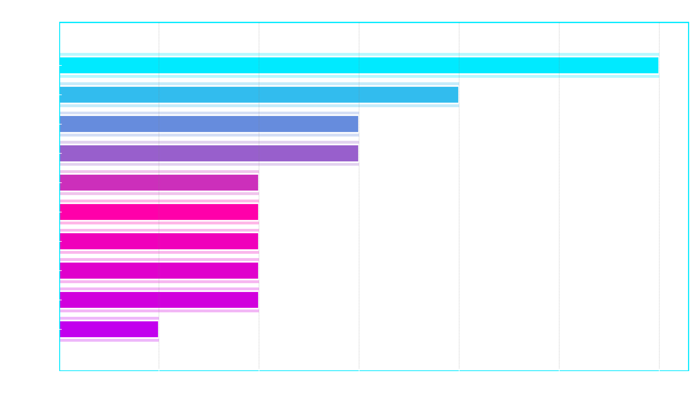

## 📌 Introduction 

Welcome to my **SQL Data Job Market Analysis Project**, where I analyse real-world Data Analyst job postings to uncover insights about salary trends, skill requirements, and overall demand within the analytics field. This project allowed me to apply SQL to answer practical, career-relevant questions and strengthen my ability to query, interpret, and communicate data effectively.

The project is organised into two main folders for clarity:

- **[Project_sql](Project_sql/)** – all SQL scripts used for the analysis  
- **[Project_Results](Project_Results/)** – exported outputs from the queries, including tables and visualisations  


This project serves both as a demonstration of my SQL capabilities and as a valuable resource to guide my learning path as an aspiring Data Analyst.

---

## 📌 Background

The motivation behind this project was to gain a deeper, data-driven understanding of the Data Analyst job market. Instead of relying on general advice or assumptions, I wanted to analyse real job posting data to see which skills employers truly value and how different skills influence salary levels, job demand, and overall opportunities in the field.

The dataset used in this project comes from **[Luke Barousse’s SQL Course](https://www.lukebarousse.com/products/sql-for-data-analytics/)**, which includes thousands of job postings with detailed information on job titles, companies, salaries, locations, and required skills.

### **Project Objectives**

- Identify the **highest-paying Data Analyst roles**  
- Determine the **skills required** for those top-paying positions  
- Analyse the **most in-demand skills** across the job market  
- Discover the **skills associated with the highest average salaries**  
- Find the **most optimal skills**, those that are both high-demand *and* high-paying  

Working through these questions helped me strengthen my SQL skills while also gaining a clear, evidence-based understanding of the current Data Analyst job landscape and the skills I should prioritise as I continue developing my career.

## 📌 Tools Used

### **SQL**
SQL was the core language used throughout this project. I used it to extract, filter, aggregate, and analyse data from multiple relational tables. SQL enabled me to answer each analytical question with precise, structured queries.

### **PostgreSQL**
PostgreSQL served as the database management system for storing and querying all job posting and skills data. Its reliability and strong support for complex queries made it ideal for this analysis.

### **Visual Studio Code (VS Code)**
VS Code was my primary development environment for writing and executing SQL scripts. Its extensions, formatting tools, and project structure made it efficient to manage all SQL files in a clean and organised way.

### **Git & GitHub**
Git was used for version control to track changes in my SQL scripts and documentation. GitHub served as the central repository for hosting this project, ensuring proper organisation, collaboration readiness, and portfolio visibility.

## 📌 The Analysis

This section breaks down each analytical question explored in the project.  
For every question, I include the SQL query used, the output (chart or table), and a detailed explanation of the insights gained. This step-by-step approach highlights how SQL can be used to extract meaningful information from real job market data.

---

## 🔎1: Top Paying Data Analyst Jobs

The first part of the analysis focuses on identifying the **top 10 highest-paying Data Analyst roles**. This query filters for jobs that list a salary and are either remote or located in London, offering a clear view of high-value opportunities in flexible work environments.

```sql
--Top 10 highest paying data analyst roles that are either remote or local
SELECT
    job_id,
    job_title,
    name AS company_name,
    job_location,
    job_schedule_type,
    salary_year_avg,
    job_posted_date,
    job_via
FROM
    job_postings_fact
LEFT JOIN company_dim ON job_postings_fact.company_id = company_dim.company_id
WHERE
    job_title = 'Data Analyst'
    AND salary_year_avg IS NOT NULL
    AND (job_location = 'Anywhere' or job_location LIKE '%London%')
ORDER BY
    salary_year_avg DESC 
LIMIT 10;
```
**📊 Quick breakdown of the top-paying Data Analyst roles:**

- **Massive Salary Variation:** Salaries range widely, with the highest role (Mantys) exceeding **$600,000**, while others sit around **$150K–$200K**.  
- **Consistently High-Paying Employers:** Companies like **Edge & Node** appear multiple times near the top, showing strong investment in analytical talent.  
- **Strong Remote Opportunities:** Most of these top-paying roles are listed as **remote (“Anywhere”)**, reflecting the high flexibility available in well-paid analytics positions.


## 🔎2: Skills Required for Top-Paying Data Analyst Jobs

After identifying the highest-paying Data Analyst roles, the next step is to understand **which skills are required for these top-paying positions**. This helps reveal the technical capabilities that consistently appear in the most lucrative job listings.

```sql
WITH top_paying_jobs AS ( 
    SELECT
        job_id,
        job_title,
        name AS company_name,
        salary_year_avg,
        job_via
    FROM
        job_postings_fact
    LEFT JOIN company_dim ON job_postings_fact.company_id = company_dim.company_id
    WHERE
        job_title_short = 'Data Analyst'
        AND salary_year_avg IS NOT NULL
        AND (job_location = 'Anywhere' or job_location like '%london%')
    ORDER BY
        salary_year_avg DESC 
    LIMIT 10
)

-- Skills required for data analyst jobs
SELECT
    top_paying_jobs.*,
    skills
FROM
    top_paying_jobs
    INNER JOIN skills_job_dim ON top_paying_jobs.job_id = skills_job_dim.job_id
    INNER JOIN skills_dim ON skills_job_dim.skill_id = skills_dim.skill_id
ORDER BY
    salary_year_avg DESC;
```
**📊 Breakdown of Skills Required for Top-Paying Data Analyst Positions:**

- **SQL** appears most frequently, confirming it as the essential skill for top-paying analyst roles.  
- **Python** is the second most common skill, showing strong demand for automation, scripting, and analytical programming.  
- Engineering-related tools like **Go**, **Node**, and **Kubernetes** appear, reflecting the rise of analytics engineering skills in high-paying roles.  
- Tools such as **Tableau**, **Looker**, and **Excel** highlight the continuing importance of data visualization and business communication.


## 🔎3: Most In-Demand Skills for Data Analysts

This query identifies the **top 5 most in-demand skills** across all Data Analyst job postings. By counting how often each skill appears, we get a clear picture of which technical abilities employers value the most in the current job market.

```sql
-- Identifies the top 5 most demanded skills for Data Analyst job postings
SELECT
  skills_dim.skills,
  COUNT(skills_job_dim.job_id) AS demand_count
FROM
  job_postings_fact
  INNER JOIN
    skills_job_dim ON job_postings_fact.job_id = skills_job_dim.job_id
  INNER JOIN
    skills_dim ON skills_job_dim.skill_id = skills_dim.skill_id
WHERE
  -- Filters job titles for 'Data Analyst' roles
  job_postings_fact.job_title_short = 'Data Analyst'
	-- AND job_work_from_home = True -- optional to filter for remote jobs
GROUP BY
  skills_dim.skills
ORDER BY
  demand_count DESC
LIMIT 5;
```
**📊 Insights into the Most In-Demand Skills for Data Analysts:**

- **SQL** is the most requested skill, making it the core requirement for Data Analyst roles.  
- **Excel** remains highly in demand, showing its continued importance in everyday analytical tasks.  
- **Python** appears frequently, reflecting its value in automation, scripting, and advanced analysis.  
- **Tableau** and **Power BI** stand out as essential tools for data visualization and dashboarding.

| Skill     | Demand Count |
|-----------|--------------|
| SQL       | 180,369      |
| Excel     | 131,822      |
| Python    | 116,082      |
| Tableau   | 90,588       |
| Power BI  | 84,353       |

This table clearly shows which technical skills employers prioritize the most in the data analytics job market.

## 🔎4: Highest-Paying Skills for Data Analysts

This query identifies the **skills associated with the highest average salaries** for Data Analyst roles. By calculating the mean salary for each skill, we can see which technical abilities lead to the strongest earning potential.

```sql
-- Calculates the average salary for job postings by individual skill 
SELECT
  skills_dim.skills AS skill, 
  ROUND(AVG(job_postings_fact.salary_year_avg),2) AS avg_salary
FROM
  job_postings_fact
  INNER JOIN
    skills_job_dim ON job_postings_fact.job_id = skills_job_dim.job_id
  INNER JOIN
    skills_dim ON skills_job_dim.skill_id = skills_dim.skill_id
WHERE
  job_postings_fact.job_title_short = 'Data Analyst' 
  AND job_postings_fact.salary_year_avg IS NOT NULL 
GROUP BY
  skills_dim.skills 
ORDER BY
  avg_salary DESC;
```
**📊 Breakdown of the Highest-Paying Skills**

- **fastapi** ranks as the highest-paying skill, with an average salary above \$210K.  
- **svn** also commands a strong salary, close to \$185K.  
- Frameworks and tools like **blazor**, **apl**, and **mxnet** show that specialised and engineering-focused skills can significantly boost earning potential.

**📄 Highest-Paying Skills (Table)**

| Skill   | Average Salary ($) |
|---------|--------------------|
| fastapi | 212,500.00         |
| svn     | 185,000.00         |
| blazor  | 161,000.00         |
| apl     | 155,000.00         |
| mxnet   | 149,000.00         |

## 🔎5: Most Optimal Skills for Data Analysts
This query identifies the **most optimal skills** for Data Analysts — meaning the skills that are both **high in demand** and **associated with high average salaries**, specifically for remote roles with reported salary data. These skills offer the strongest combination of job security and earning potential.

```sql
WITH skills_demand AS (
  SELECT
    skills_dim.skill_id,
    skills_dim.skills,
    COUNT(skills_job_dim.job_id) AS demand_count
  FROM
    job_postings_fact
    INNER JOIN skills_job_dim ON job_postings_fact.job_id = skills_job_dim.job_id
    INNER JOIN skills_dim ON skills_job_dim.skill_id = skills_dim.skill_id
  WHERE
    job_postings_fact.job_title_short = 'Data Analyst'
    AND job_postings_fact.salary_year_avg IS NOT NULL
    AND job_postings_fact.job_work_from_home = True
  GROUP BY
    skills_dim.skill_id
),

average_salary AS (
  SELECT
    skills_job_dim.skill_id,
    AVG(job_postings_fact.salary_year_avg) AS avg_salary
  FROM
    job_postings_fact
    INNER JOIN skills_job_dim ON job_postings_fact.job_id = skills_job_dim.job_id
  WHERE
    job_postings_fact.job_title_short = 'Data Analyst'
    AND job_postings_fact.salary_year_avg IS NOT NULL
    AND job_postings_fact.job_work_from_home = True
  GROUP BY
    skills_job_dim.skill_id
)

SELECT
  skills_demand.skills,
  skills_demand.demand_count,
  ROUND(average_salary.avg_salary, 2) AS avg_salary
FROM
  skills_demand
  INNER JOIN average_salary ON skills_demand.skill_id = average_salary.skill_id
WHERE demand_count > 10
ORDER BY
  demand_count DESC, 
  avg_salary DESC
LIMIT 10;
```
**📊 Breakdown of the Most Optimal Skills**

- **SQL** leads with the highest demand and a strong average salary, making it the most strategic skill overall.  
- **Tableau** shows very high demand paired with an impressive six-figure average salary.  
- **Python** remains a top skill for both salary potential and versatility.  
- **Excel**, **R**, **Power BI**, and **Looker** also rank highly, showing their continued value across analytics roles.

**📄 Top Most Optimal Skills**

| Skill       | Demand Count | Average Salary ($) |
|-------------|--------------|---------------------|
| sql         | 783          | 98,747.78           |
| tableau     | 505          | 102,171.66          |
| python      | 494          | 98,074.43           |
| excel       | 441          | 88,201.95           |
| power bi    | 293          | 95,534.53           |
| r           | 289          | 97,421.10           |
| looker      | 117          | 94,281.41           |
| sas         | 110          | 94,101.11           |
| powerpoint  | 97           | 88,566.68           |

This table highlights the skills that offer the **best balance of job market demand and high earning potential**, making them ideal for Data Analysts looking to maximise career opportunities.

**📝 Summary of All Queries**

Across these five SQL analyses, this project provides a clear overview of the Data Analyst job market. It highlights the highest-paying roles, the skills required for them, the most in-demand skills overall, and the skills linked to the strongest salaries. By combining demand and salary data, the final query identifies the most optimal skills for career growth—showing that SQL, Python, Tableau, Excel, and Power BI consistently offer the best balance of high demand and high earning potential.

## 🎓 What I Learned

Working on this project helped me strengthen my SQL skills while developing a clear, data-driven understanding of the Data Analyst job market. I learned how to translate real analytical questions into structured SQL queries and how to interpret the results to uncover meaningful insights. Throughout the analysis, I improved my ability to:

- **Build Advanced SQL Queries:** I became more confident using joins, CTEs, subqueries, and aggregate functions to analyse large datasets and answer multi-layered questions.
- **Understand Skill Demand and Salary Patterns:** By examining job postings, I learned which skills consistently appear across the industry and how different technologies influence earning potential.
- **Identify High-Value Skills:** Combining demand and salary data showed me which skills offer the strongest return on investment—skills like SQL, Python, Tableau, and Power BI proved to be both in high demand and associated with strong salaries.
- **Recognise the Value of Niche Tools:** I discovered that specialised technical skills, even if less common, can command significantly higher salaries, making them worthwhile for analysts looking to differentiate themselves.
- **Analyse Real Job Market Trends:** Comparing remote and London-based postings helped me understand how opportunities differ across locations and how job platforms influence where top-paying roles are found.
- **Communicate Insights Clearly:** Preparing this project for a portfolio reinforced the importance of presenting data, results, and insights in a structured and professional manner.

Overall, this project not only strengthened my SQL expertise but also gave me practical career insights into what hiring managers look for and which skills can create the greatest opportunities in the field of data analytics.


## 🏁 Conclusion

This project provided a comprehensive, data-driven overview of the Data Analyst job market by examining salary trends, in-demand skills, and the technologies that offer the strongest career value. Through five focused SQL analyses, I identified the highest-paying roles, the skills required for those roles, the most demanded skills across the industry, and the tools associated with the highest average salaries. By combining salary and demand insights, I was also able to determine the most optimal skills, those that provide both strong earning potential and long-term job security.

Several key insights emerged from this analysis:

- **Top-Paying Roles:** The highest-paying Data Analyst positions, many of which were fully remote—showed extremely wide salary variation, with the top role exceeding **$600,000**, highlighting how valuable certain specialised analytical roles can be.  
- **Skills for Top-Paying Jobs:** SQL and Python appeared consistently across the highest-paying roles, confirming their importance for accessing premium opportunities.  
- **Most In-Demand Skills:** SQL remained the most requested skill across all postings, followed closely by Excel, Python, Tableau, and Power BI, making them essential for anyone entering the field.  
- **Skills With Higher Salaries:** Niche or engineering-focused technologies such as **FastAPI**, **SVN**, **Blazor**, and **APL** were associated with significantly higher average salaries, showing the value of specialising beyond traditional analytics tools.  
- **Optimal Skills for Career Growth:** SQL, Tableau, Python, Excel, and Power BI offered the strongest combination of high demand and high salary, making them the smartest skills to prioritise for long-term career development.

Beyond the technical SQL work, this project deepened my understanding of employer expectations and the competitive landscape of data analytics. The insights gained here will guide my learning priorities moving forward, ensuring that I continue building the skills that matter most in this field. Overall, this project strengthened my analytical abilities, improved my SQL proficiency, and provided clear direction for navigating and advancing within the data analytics job market.
